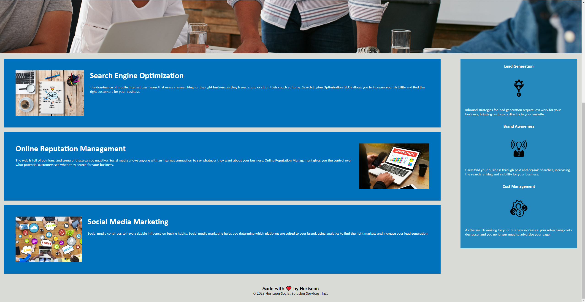

# Horiseon Website README

## Overview

This repo contains source code for the Horiseon website which has been altered to be semanticially correct. This README provides an overview of the website.

## Website Structure

The website structure is as follows:

- **HTML File**: The main HTML file is named `index.html`. It defines the structure and content of the web page,and includes semantic elements such as: header, main content, aside, and footer.

- **CSS Stylesheet**: The CSS is in a stylesheet named `styles.css`. This stylesheet is linked to the HTML file to control the website's appearance.

## Content

This website has the following sections:

1. **Header**: The header includes a Horiseon logo and a nav menu with links to different parts of the page.

2. **Main Content**: The main content consists of three sections:
   - **Search Engine Optimization**: Has info about the importance of SEO.
   - **Online Reputation Management**: Talks about online reputation management.
   - **Social Media Marketing**: Describes more about social media marketing.

3. **Aside (Benefits)**: The aside section lists Horiseon's services:
   - **Lead Generation**: Describes how inbound strategies for lead generation require less work.
   - **Brand Awareness**: Talks about how users find your buisness.
   - **Cost Management**: Discusses ranking for busines.

4. **Footer**: The footer includes a cute message from Horiseon.
  
## Links and Images

- **Screenshots of the Website**:   

- **Website Link**: https://empireantz.github.io/week-1-challenge/

